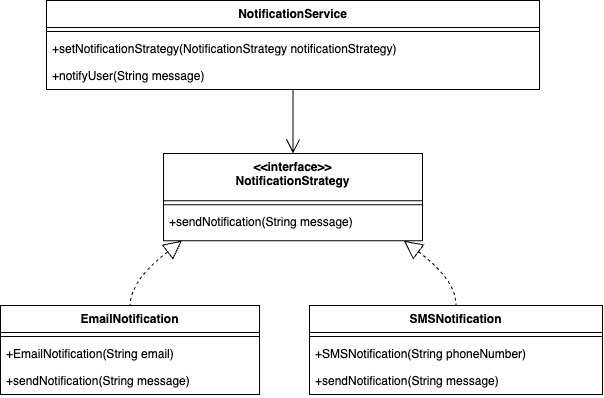
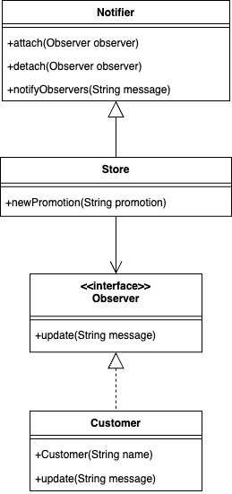

# Design Patterns Assignment

This project is a demonstration of two design patterns: **Strategy** and **Observer**. The project is divided into two separate modules:

1. **Strategy Pattern (StrategyPattern)**
   - The Strategy pattern is used to define a family of algorithms (notification methods) and make them interchangeable.
   - It allows the notification method to be selected at runtime, promoting flexibility and scalability.

   - **Classes Included**:
     - `NotificationStrategy`: Interface representing the notification strategy.
     - `EmailNotification`, `SMSNotification`: Concrete implementations of the `NotificationStrategy` interface.
     - `NotificationService`: A service class that uses the notification strategy.
     - `Main`: Driver class to demonstrate sending notifications using different strategies.

   

2. **Observer Pattern (ObserverPattern)**
   - The Observer pattern is used to allow multiple objects (customers) to receive updates when the state of another object (store) changes.
   - This pattern helps in building a subscription mechanism to notify multiple observers about events.

   - **Classes Included**:
     - `Observer`: Interface representing the observer.
     - `Notifier`: Class representing the subject being observed, which manages observers.
     - `Store`: Concrete class that notifies customers when there is a store promotion.
     - `Customer`: Concrete observer that receives updates from the store.
     - `Main`: Driver class to demonstrate the observer pattern.

   

## Project Structure
The project is divided into the following packages and files:

### StrategyPattern
- `NotificationStrategy.java`: Interface representing notification strategies.
- `EmailNotification.java`, `SMSNotification.java`: Concrete implementations of notification strategies.
- `NotificationService.java`: Class that manages sending notifications using a selected strategy.
- `Main.java`: Driver class to demonstrate the Strategy pattern.

### ObserverPattern
- `Observer.java`: Interface representing the observer.
- `Notifier.java`: Class representing the subject being observed, which manages observers.
- `Store.java`: Concrete class that notifies customers.
- `Customer.java`: Concrete observer representing a customer.
- `Main.java`: Driver class to demonstrate the Observer pattern.

## How to Run
Run the `Main` class in each package to see the respective design patterns in action.
