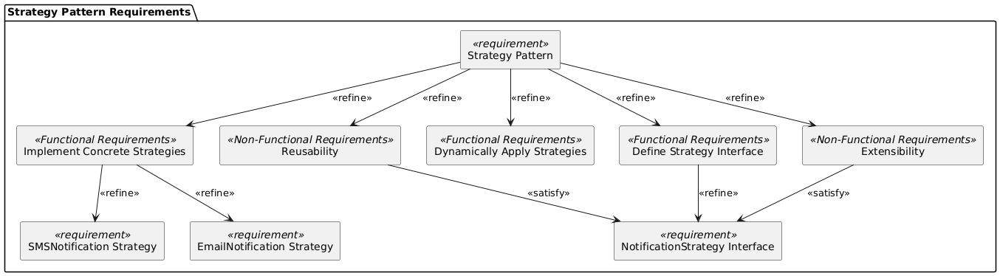

# Design Patterns Assignment

This project is a demonstration of two design patterns: **Strategy** and **Observer**. The project is divided into two separate modules:

## 1. **Strategy Pattern (StrategyPattern)**
   - The **Strategy pattern** is used to define a family of algorithms (notification methods) and make them interchangeable.
   - It allows the notification method to be selected dynamically at runtime, promoting flexibility and scalability.
   - This implementation focuses on dynamically selecting and applying notification strategies such as Email and SMS.

   ### **Classes Included:**
   - **`NotificationStrategy`**: Interface representing the notification strategy.
   - **`EmailNotification`**, **`SMSNotification`**: Concrete implementations of the `NotificationStrategy` interface.
   - **`NotificationService`**: A service class that dynamically selects and applies the notification strategy.
   - **`Main`**: Driver class to demonstrate the Strategy Pattern.

   

---

## 2. **Observer Pattern (ObserverPattern)**
   - The **Observer pattern** allows multiple objects (observers) to receive updates when the state of another object (subject) changes.
   - This implementation focuses on building a subscription mechanism where customers can receive store promotions dynamically.

   ### **Classes Included:**
   - **`Observer`**: Interface representing the observer.
   - **`Notifier`**: Class representing the subject being observed, which manages observer registration and notifications.
   - **`Store`**: Concrete implementation of `Notifier` to notify customers about promotions.
   - **`Customer`**: Concrete observer that receives updates from the store.
   - **`Main`**: Driver class to demonstrate the Observer Pattern.

   

---

## Project Structure
The project is organized into the following packages and files:

### **StrategyPattern**
- **`NotificationStrategy.java`**: Interface representing notification strategies.
- **`EmailNotification.java`, `SMSNotification.java`**: Concrete implementations of notification strategies.
- **`NotificationService.java`**: Class that manages dynamic strategy selection and application.
- **`Main.java`**: Driver class to demonstrate the Strategy Pattern.

### **ObserverPattern**
- **`Observer.java`**: Interface representing observers.
- **`Notifier.java`**: Class managing a list of observers and notifying them of changes.
- **`Store.java`**: Concrete implementation of `Notifier` for store promotions.
- **`Customer.java`**: Concrete observer receiving updates about store promotions.
- **`Main.java`**: Driver class to demonstrate the Observer Pattern.

---

## Requirements Diagram
The requirements diagram outlines the **functional** and **non-functional requirements** for both design patterns, showing the relationships between high-level requirements and their refinements.

### **Strategy Pattern Requirements Diagram**
The **Strategy Pattern Requirements Diagram** focuses on implementing a flexible system to dynamically select and apply notification strategies.

   
---

## How to Run
1. Navigate to the respective pattern package (`StrategyPattern` or `ObserverPattern`).
2. Run the `Main` class in each package to see the respective design patterns in action.

---

### **Key Highlights**
- **Extensibility**: Both modules emphasize ease of adding new features (e.g., new notification strategies or new observer types) without changing existing code.
- **Reusability**: Strategies and observers can be reused across multiple contexts.
